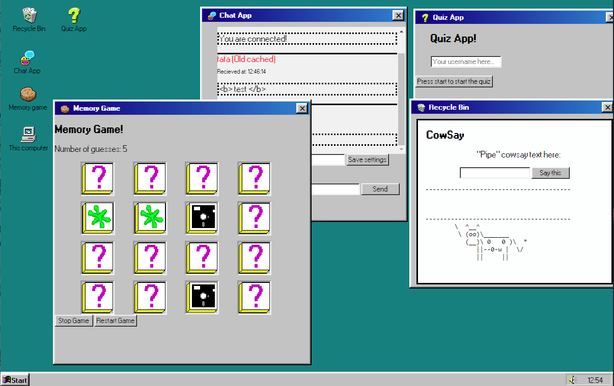
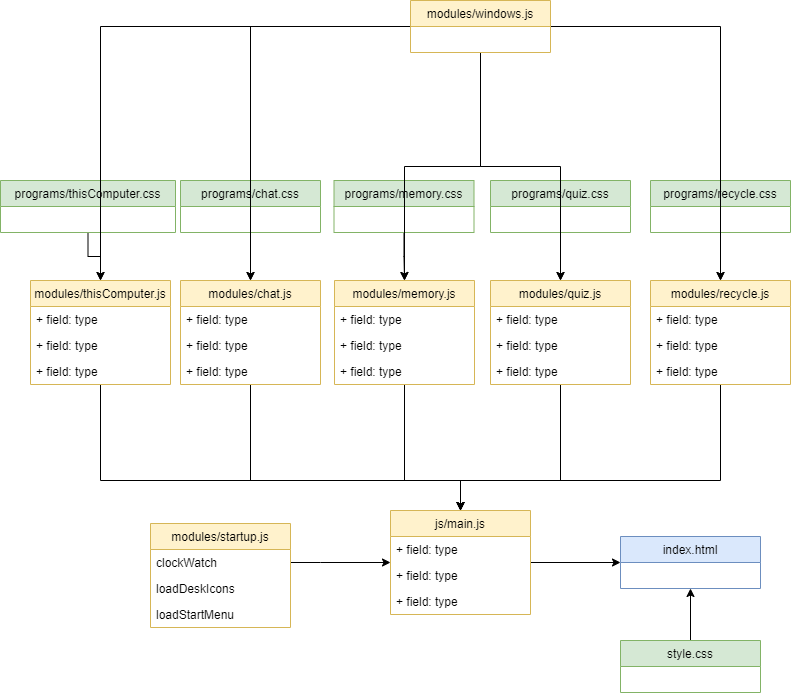

# Windows 98 Alva Edition - A3 SPA



## Intoduction
This is a program made by Alva Widerberg Palmfeldt for a course in the bachelor degree program Network security.

## Description of the program
This webprogram is trying to look like Windows 98 SE to some degree. This is a window manager with multiple built in apps and a "for looks" start bar. It is somewhat dynamically designed meaning you can add apps with minimal change. All programs are implemented into classes containing shadowroot for added abstraction and are appended to the main screen. The programs have their own custom element type. The clock in the right hand corner get automatically updated.

There are 5 programs in total on the desktop, four of which could be considered more "serious". 

* "This computer" which contains a funny popup.
    * It also works as a template if you want to quickly add more programs.
* "Memory game" which is as it sounds, a memory game. 
    * Note that the block icons were taken from "Symantec Memory Blocks (1991)". The blocks were screenshotted and cleaned up in Photoshop.
* "Chat App" which is the chat application connected to the LNU server.
    * Up to 10 messages will be saved when you close the program.
* "Recycle Bin" which is a simple Cowsay.
    * This is as it sounds, a simple cowsay program, that takes the input of the user and prints it as cowsay. This was added last minute as a bonus feature.

* "Quiz App" The quiz app from assignment 2 converted to a class for this application.


The following class diagram shows the final program structure. Windows.js get extended into every program for the window. The window program has the logic for how programs can be dragged, clicked on, closed etcetera. Each program has a icon along with window width and height defined in the program's CSS file. The programs themselves are made in seperate javascript files. Each program js is a class that has a container that has a boilerplate html that gets automatically inserted into the program. startup.js contains two functions that load up the desktop icons and the start menu bar. It also has a function for the auto updated clock. Finally, in the main.js we can find the eventlisteners for each icon along with a function for highlighting a clicked icon.

### How to add a new program
To add a new program, the user can simply copy the "js\modules\computerApp.js" along with "css\programs\computerApp.css" and add their own code. Each program is its seperate class that implements the windows.js class. After renaming your app you can simply import the new program .js file in the main.js file. To add the start icon on the desktop you can modify the program's css file. 

To continue, the css\style.css file contains the position of all the icons. Add the new id for the program and then add the position for were it should be on the desktop. Note that you'll need to add the icon element to the startup.js file.

## Notes
Note that the icons for the Quiz App, Chat app and Memory game are taken from the windows93 website: https://www.windows93.net/

The converted windows 98 font is taken from the 98.css project: https://github.com/jdan/98.css

The font conversion could've been done manually, but due to time constraints in this assignmnet the premade version was used.


## TODO if I ever decide to pick up on this project again
* Make the icon adding a bit more simple. For now, the user needs to add the icon manually in the startup.js file.

* Add a clickable start menu.

* Add a way to minimize programs to the start menu.


## Running instructions:
There are multiple ways of running this program. 
You'll need to host the program with a webserver in some kind of way. This means using for example Apache, XAMPP, your favorite IDE with a webserver, etcetera, and place the contents of the src file in the "www" folder. 

Alternatively, if you want to host this on a website you should build the program and then take build contents and host that. That will provide much smaller code.

This is done with the command:
```console
npm run build
npm run serve
``` 

When you go to the URL that contains the program, you simply dubbleclick one of the icons. The start menu is just for added aestetics and does not do anything.